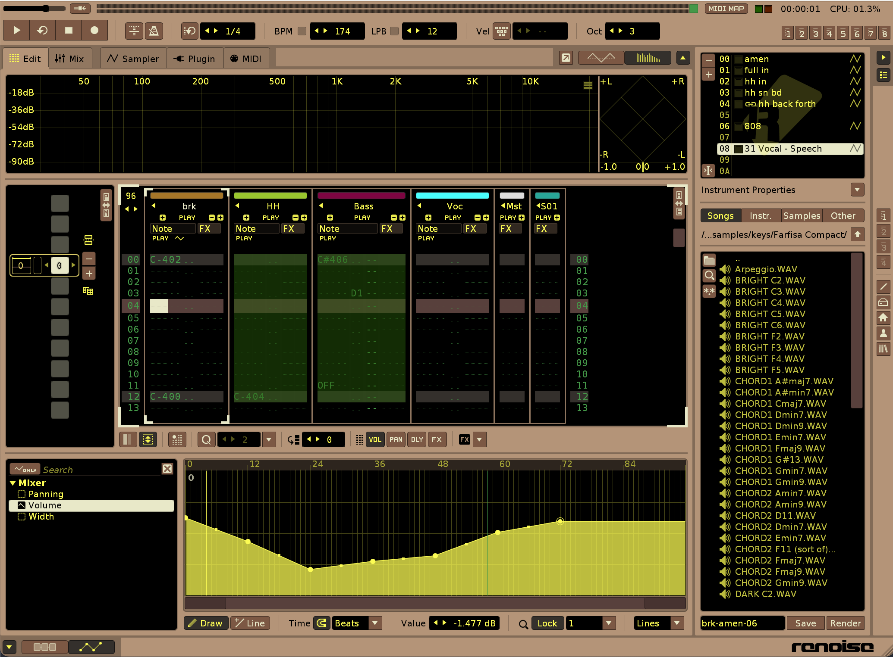

# Renoise theme based on Impulse Tracker

Based on https://github.com/HALDETROIT/IMPULSE-TRACKER-THEME with some tweaks to make it look more like Impulse Tracker. Also cleaned it up a little and made it more consistent so it's easier to change color values should you want to.
 
## Colors used

- Black: 0,0,0
- White: 232,232,200
- Light brown bg: 180,148,120
- Highlight brown: 88,64,60
- Column header brown: 124,88,68
- Pattern highlighted bg: 52,48,44
- Green text: 68,152,72
- Green selected bg: 40,90,12
- Yellow text: 252,252,84
- Red: 125,5,66

## Screenshot

